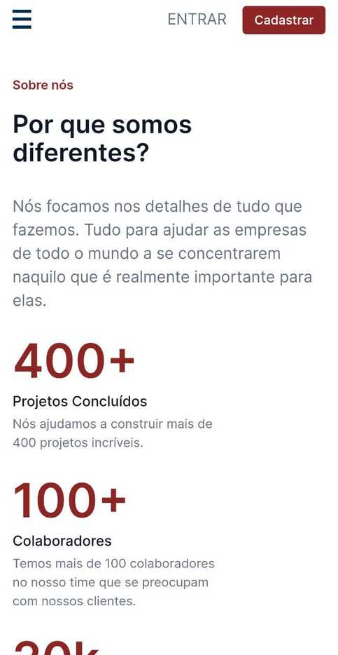
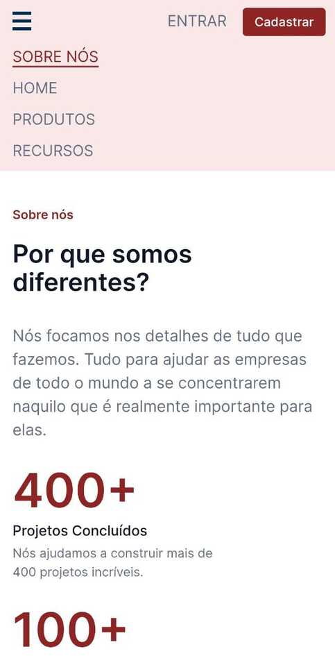

# 7 days of code 

[7 days of code](https://7daysofcode.io/) são desafios em tecnologia cujo objetivo é colocar em prática os conhecimentos aprendidos.

## Tópicos
- [Desafios](#desafios)
  - [HTML e CSS](#html-e-css)
    - [Screenshot](#screenshot)
    - [Layout responsivo](#layout-responsivo)
    - [Screenshot](#screenshot-1)
    - [Links](#links)

## Desafios 

### HTML e CSS

O primeiro desafio que estou realizando é o de HTML e CSS e consiste em deselvover uma página destinada a novas contratações de uma empresa de TI. 

#### Screenshot

#### Layout Responsivo
Como parte de um desafio extra, desenvolvi uma versão de layout mobile 

#### Screenshot

  
  

#### Links
* [Confeir o protótipo figma](https://www.figma.com/file/mm3MLozvUDGhDRTxSLlGL5/7daysOfCode-HTML-CSS?node-id=0%3A1)
* [Conferir o código fonte](https://github.com/nalutm/seven-days-of-code/tree/main/html-css)
* [Conferir o resultado final](https://html-csss.vercel.app/)