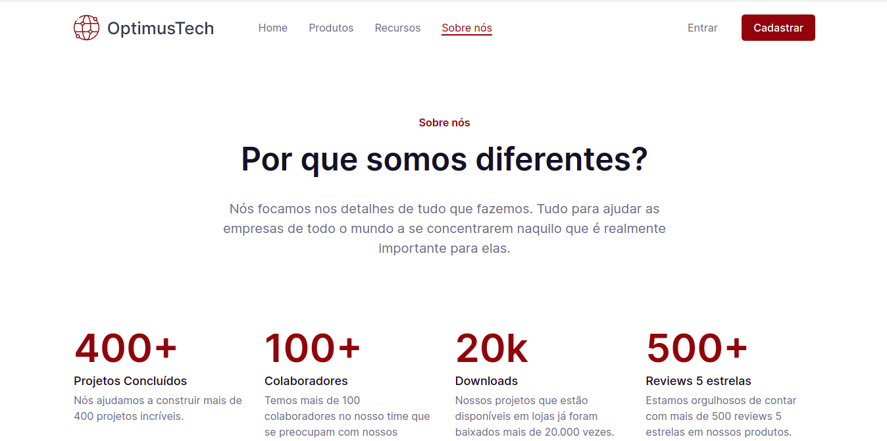
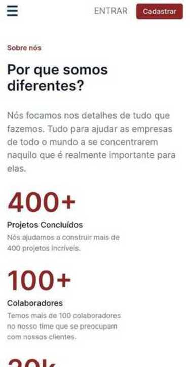
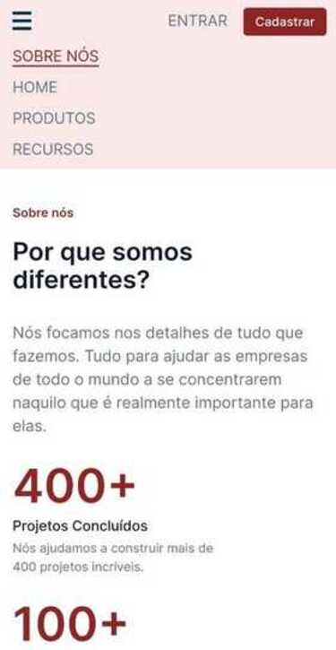
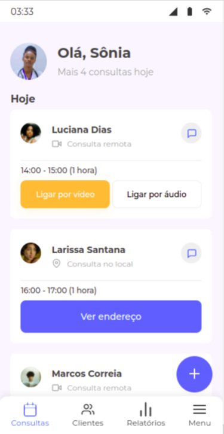
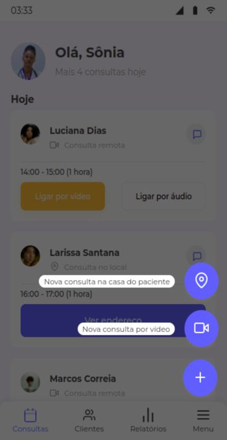
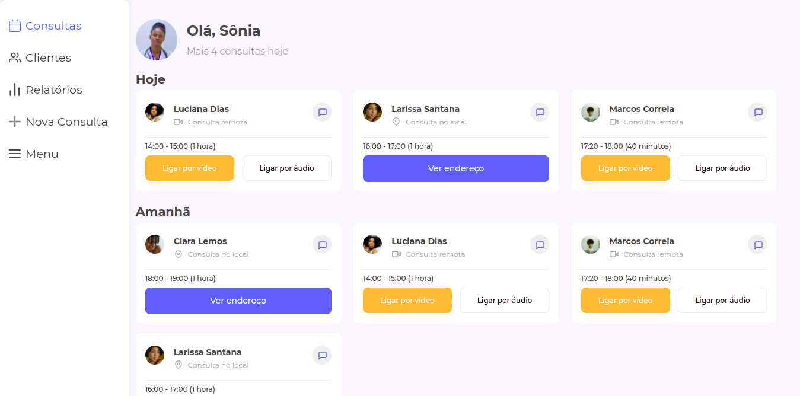

# 7 days of code 

[7 days of code](https://7daysofcode.io/) são desafios em tecnologia cujo objetivo é colocar em prática os conhecimentos aprendidos.

## Tópicos
- [Desafios](#desafios)
  - [HTML e CSS](#html-e-css)
    - [Screenshot](#screenshot)
    - [Layout responsivo](#layout-responsivo)
    - [Screenshot](#screenshot-1)
    - [Links](#links)

  - [Responsividade](#responsividade)
    - [Screenshot](#screenshot-2)
      - [Mobile](#mobile)
      - [Desktop](#desktop)
    - [Links](#links-1)

- [Autora](#autora)

## Desafios 

### HTML e CSS

Resolução do desafio sobre HTML e CSS que consiste em desenvolver uma página destinada a novas contratações de uma empresa de TI. 

#### Screenshot

#### Layout Responsivo
Como parte de um desafio extra, desenvolvi uma versão de layout mobile 

#### Screenshot

  
  

#### Links
* [Protótipo figma](https://www.figma.com/file/mm3MLozvUDGhDRTxSLlGL5/7daysOfCode-HTML-CSS?node-id=0%3A1)
* [Código fonte](https://github.com/nalutm/seven-days-of-code/tree/main/html-css)
* [Resultado final](https://seven-days-of-code-beta.vercel.app/)

### Responsividade
Resolução do desafio sobre responsividade que consiste em desenvolver uma página responsiva para que os médicos e médicas contratados de uma clínica médica possam ter controle sobre todas suas consultas agendadas, sejam elas presenciais ou remotas. 

#### Screenshot

##### Mobile

  
  

#### Desktop

#### Links
* [Protótipo figma](https://www.figma.com/file/4OjHFmeHAgfX2JpRymOeA0/7days---Responsividade?node-id=6%3A622)
* [Código fonte](https://github.com/nalutm/seven-days-of-code/tree/main/responsividade)
* [Resultado final](https://seven-days-of-code-henna.vercel.app/)

## Autora 
[Nayara Luiza Tavares Moraes](https://github.com/nalutm)
