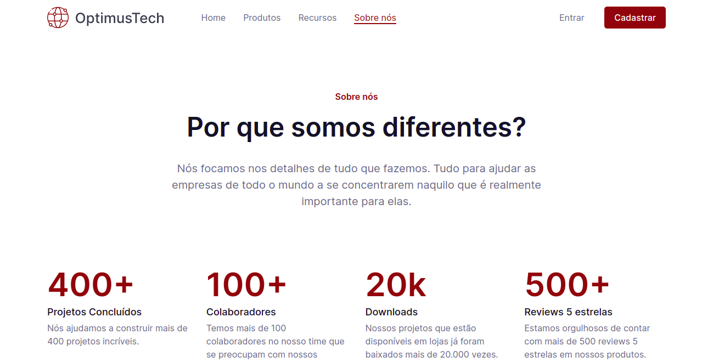

# 7 days of code | HTML & CSS

### Tópicos

* Descrição do projeto
* Status do projeto
* Linguagens utilizadas 
* Acesso ao projeto
* Autora

## Descrição do projeto
Desafio [7 days of code](https://7daysofcode.io/) sobre HTML e CSS, consiste em deselvover uma página destinada a novas contrataçõe de uma empresa de TI. Foi disponibilizado um [protótipo figma](https://www.figma.com/file/mm3MLozvUDGhDRTxSLlGL5/7daysOfCode-HTML-CSS?node-id=0%3A1). 

A partir desse desafio treinei: 
* desenvolver o código a partir de um protótipo;
* abordagem Mobile First;
* flexbox;
* layout responsivo;
* componentização;

Como parte de um desafio extra, desenvolvi uma versão de layout mobile 

  
  

## Status do Projeto
Finalizado

## Linguagens Utilizadas
* HTML;
* CSS;

## Acesso ao projeto
Você pode acessar o [código fonte do projeto](https://github.com/nalutm/seven-days-of-code/tree/main/html-css). Também pode acessar a [página para conferir o resultado final](https://seven-days-of-code-beta.vercel.app/).

## Autora
[Nayara Luiza Tavares Moraes](https://github.com/nalutm)

