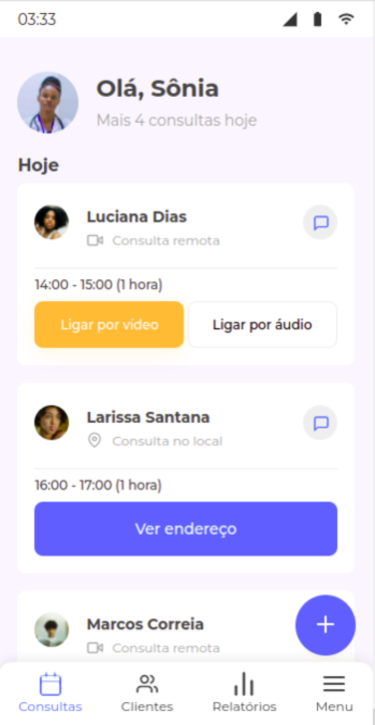

# 7 days of code | RESPONSIVIDADE

### Tópicos

- [Descrição do projeto](#descrição-do-projeto)
    - [Processo de desenvolvimento](#processo-de-desenvolvimento)
    - [Screenshot](#screenshot)
      - [Mobile](#mobile)
      - [Desktop](#desktop)
- [Status do projeto](#status-do-projeto)
- [Linguagens utilizadas](#linguagens-utilizadas) 
- [Acesso ao projeto](#acesso-ao-projeto)
- [Autora](#autora)

## Descrição do projeto

Resolução do desafio [7 days of code](https://7daysofcode.io/) sobre responsividade que consiste em, a partir de um [protótipo figma](https://www.figma.com/file/4OjHFmeHAgfX2JpRymOeA0/7days---Responsividade?node-id=0%3A1), desenvolver uma página responsiva para que os médicos e médicas contratados de uma clínica médica possam ter controle sobre todas suas consultas agendadas, sejam elas presenciais ou remotas 

### Processo de Desenvolvimento
A partir desse desafio treinei: 
* desenvolver o código a partir de um protótipo;
* abordagem Mobile First;
* flexbox;
* CSS grid;
* layout responsivo;
* componentização;

### Screenshot

#### Mobile

  
  

#### Desktop

## Status do Projeto
Finalizado

## Linguagens Utilizadas
* HTML;
* CSS;
* JS

## Acesso ao projeto
Você pode acessar o [código fonte do projeto](https://github.com/nalutm/seven-days-of-code/tree/main/responsividade). Também pode acessar a [página para conferir o resultado final](https://seven-days-of-code-henna.vercel.app/).

## Autora
[Nayara Luiza Tavares Moraes](https://github.com/nalutm)